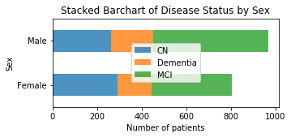

## Alzheimer's Detection from ADNI data

This project was submitted to fulfill requirements of the Intro to Data Science (CS109A) course at the Harvard Graduate School of Engineering and Applied Sciences. Team members: Jonathan Fisher, Kezi Cheng, Nikhil Mallareddy

## Data set
For this analysis, we merged two data sets:
  1. ADNIMERGE - Contains data about various clinical, genetic, and imaging biomarkers from participants in a longitudinal multi-center study.

  2. UPENN-CSF - Contains information about concentration of Amyloid beta compounds in cerebro-spinal fluid (CSF), which is known to be strongly correlated with  Alzheimer's disease risk.

Disease status is classified into three categories:
  1. Cognitively normal (CN)
  2. Mild cognitive impairment (MCI)
  3. Alzheimer's disease (AD)

Distribution of patients across the three classes is shown below:

Both data sets are available (with access controls) at adni.loni.usc.edu

*Data used in preparation of this article were obtained from the Alzheimer’s Disease
  Neuroimaging Initiative (ADNI) database (adni.loni.usc.edu). As such, the investigators
  within the ADNI contributed to the design and implementation of ADNI and/or provided data
  but did not participate in analysis or writing of this report. A complete listing of ADNI
  investigators can be found at:
  http://adni.loni.usc.edu/wp-content/uploads/how_to_apply/ADNI_Acknowledgement_List.pdf*

## Objective
The question we want to answer is:

>What is the minimal set of diagnostic predictors that can lower the overall cost of clinical testing without sacrificing a substantial degree of diagnostic accuracy?

Therefore, our goal is not to develop a machine learning algorithm that accurately predicts Alzheimer's disease risk, but to find out which clinical diagnostic tests have the most influence on final positive diagnosis.

## Summary of Results

We trained 6 baseline models and chose the multinomial logistic regression model as the best performing one. An important part of our analysis was to compare the contribution of each predictor to model accuracy against its summary cost metric (which is an aggregate cost function combining costs in performing the test and cost incurred due to the stage at which disease is diagnosed). The key result is that genetic tests offer the optimal tradeoff between cost and accuracy of prediction.

## Dependencies

Python libraries - NumPy, Pandas, SciPy, Scikit-learn, statsmodels, Matplotlib, Seaborn, datetime

The complete project is published at <https://knickhill.github.io/alzheimers-prediction/>
The associated jupyter notebook can be found at <https://knickhill.github.io/alzheimers-prediction/model.html>
